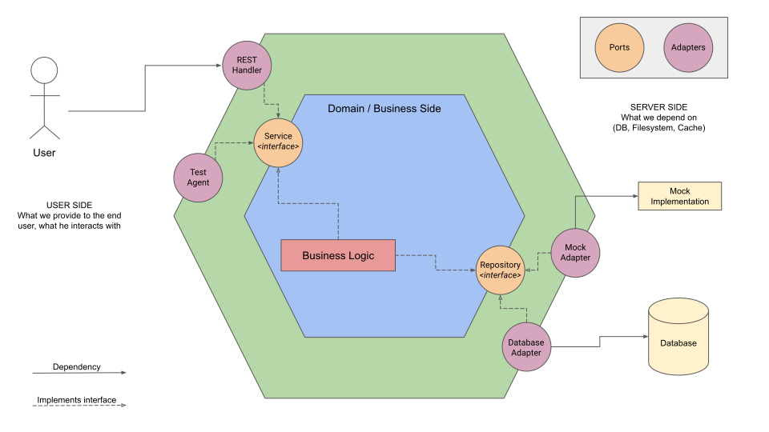

# Bienvenidos 😁

Este proyecto lo he construido a partir del lenguaje de programación Go, un lenguaje maravilloso, compacto y de mucho potencial (sino pregúntenles a sus DevOps sobre Docker y K8s), a pesar de ser un proyecto pequeño, me encantó, fue gimnasia cerebral 💪🏽 🧠 practicar y practicar => *"La practica hace al maestro"* dicen por ahí! Así que comencemos!!!.

## Tecnologías utilizadas acá:

- Go 1.17
- PostgresSQL 13 como base de datos
- Docker / Docker Compose
- Redis para el manejo de caché

He utilizado un framework web para Go: **Gin-gonic**, que cuenta con bastante difusión y es de los más potentes hasta la fecha, como ORM (Object Relational Mapper) **GORM** que cuenta también con los diversos drivers para los motores de bases de datos relacionales más populares hasta la fecha (PostgreSQL es uno de ellos)

### Arquitectura:
Si hay una de las cosas más fascinantes que he visto hasta la fecha con Go, o que me ha permitido comprender bastante bien, ha sido la **Arquitectura Hexagonal**, empecé a investigar en base a un video de CodelyTV y logré ciertos avances. Para este proyecto implementé una aproximación a esta arquitectura, si bien no he sido ortodoxo con la disposición de las carpetas, intenté hacer el *"separation of concerns"* de un modo bastante más legible, otro dato importante que notar en esta arquitectura, es el predominio de la **inyección de dependencias**, podría decir que es la piedra angular de la Arquitectura Hexagonal.

### Testing
Dado a que la Arquitectura Hexagonal se fundamenta principalmente en la inyección de dependencias, es bastante sencillo hacer _mocks_ de _handlers_ (controladores) y de servicios, todo esto a partir de un paquete llamado **go-mock** que utiliza línea de comandos (preferiblemente) y también marcaje de las interfaces a mockear. Para la base de datos he utilizado **sqlmock** que implica utilizar también **testify** eso para testear los dominios.

### Diagrama:


### Decisiones:
- Al momento de escribir este documento, se levantó un servidor en Redis, con la idea de tomar todos los valores de monedas al momento para ser almacenados en Redis, **¿Cuál es la idea detrás de eso? Reducir la cantidad de peticiones, dado a que el plan gratis es de 250 peticiones al mes, podemos reducir eso a 2 o 3 peticiones por día.** Para el 03/01/2022 no he hecho la implementación final de este feature.

- **¿Por qué usar GORM y no usar Raw SQL?** La idea detrás de los ORM es siempre la posibilidad de poder incorporar nuevos motores de bases de datos a los repositorios, escribir la implementación de cada consulta, que en muchos casos es menos compleja que usando raw SQL, por ejemplo si se quiere reemplazar PostgreSQL por ElasticSearch teniendo un mínimo impacto, casi nulo en las capas exteriores al dominio.

- **¿Por qué usar Gin-Gonic y no usar Mux u otro framework (Echo o Fiber2 por ejemplo)?** Principalmente porque es el framework con el que más tiempo he reunido experiencia, tiene un alto performance, quizás no el mayor pero está dentro de los mejores y hay mucha documentación y comunidad alrededor de Gin-gonic, por otro lado posee una serie de características que lo hacen muy atractivo: Un logging en modo debug bien informativo, incluyendo la velocidad de la peticiones, sin embargo es bastante flexible para configurar middlewares y loggers definidos por el desarrollador.

- Se instaló el paquete **JobRunner** para ejecutar *background jobs*, ciertamente el paquete tiene al menos 2 años de antigüedad, sin embargo para los efectos de este ejercicio es bastante pertinente.
- PostgreSQL se encuentra en el puerto 9001, debido a que quise sacarlo fuera del rango de los puertos que utilizo para otras cosas.

### Ejecución:
```bash
# Para construir la imagen
docker compose build

# Para construir la imagen y levantar los contenedores
docker compose up --build

# Para ejecutar los tests
go test ./... -cover # por si quieren ver el coverage
go test ./api -cover # para ver por capa
go test ./services -cover # para ver por capa
go test ./handlers -cover # para ver por capa
```

### Endpoints
| Endpoint                                                    | Verbo HTTP |  Explicación                                                              | Respuestas                                                                        |
|-------------------------------------------------------------|------------|---------------------------------------------------------------------------|-----------------------------------------------------------------------------------|
| localhost:8082/beers/                                       | GET        | Obtener todas las cervezas                                                | 200: Operacion satisfactoria 404: No encontrados                                  |
| localhost:8082/beers/                                       | POST       | Crear nueva cerveza                                                       | 201: Cerveza creada 404: Cerveza no encontrada 409: El ID de la cerveza ya existe |
| localhost:8082/beers/:id                                    | GET        | Obtener una cerveza por su ID                                             | 200: Operacion satisfactoria 404: Cerveza no encontrada                           |
| localhost:8082/beers/:id/boxprice?currency=XXX&quantity=YYY | GET        | Obtener una cerveza por su ID con un valor en otra moneda y por caja/lote | 200: Price Total: xxxxx.yyy                                                       |

### Pendientes:
- Incorporar un logger custom
- Incorporar autenticación vía por JWT
- Documentar a través de OpenAPI / Swagger
- Refactorizar el testing para crear un método de `setup` y limpiar el código
- Implementar la utilización de Redis para una única petición diaria del precio de las monedas. Dado a que si se omite en la URL de [Currency Layer](http://api.currencylayer.com) un parámetro denominado `currency` y trae todos los valores de cambio de monedas con a partir del dólar norteamericano.
- Completar y depurar los tests de los dominios (domain).